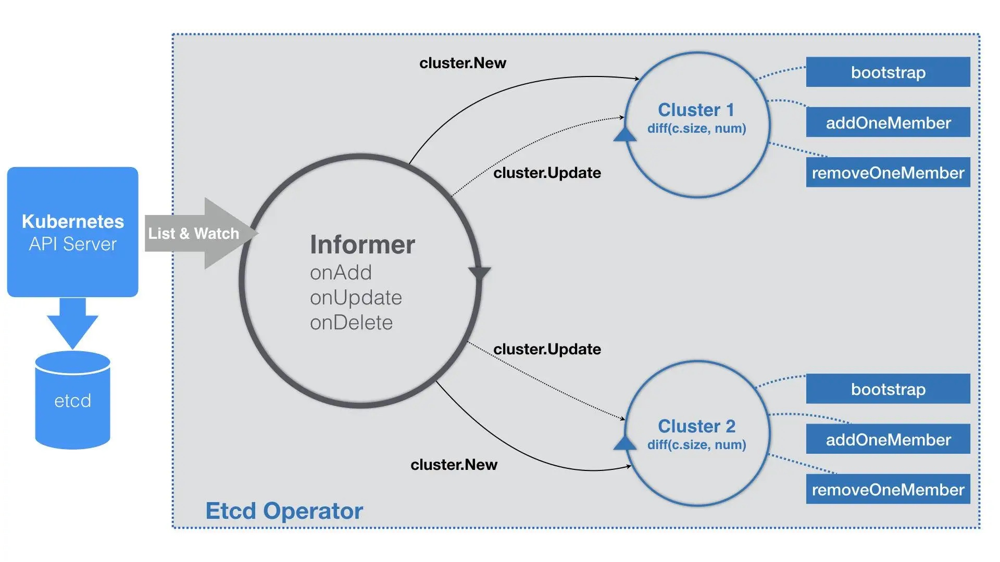

# Day13 深入剖析 Kubernetes - 容器編排與 Kubernetes 作業管理

## Operator 工作原理

在 Kubernetes 生態中，還有一個相對**更加靈活和編程友好的管理有狀態應用的解決方案**，它就是：`Operator`。跟前面提到的 `Custom Controller` 原理上是同一個東西。

以 `Etcd Operator` 討論 Operator 工作原理和編寫方式

- 在部署 Etcd Operator 的 Pod 之前，需要先運行 `create_role.sh`
    - 腳本的作用，就是為 Etcd Operator **創建 RBAC 規則**
```shell
$ git clone https://github.com/coreos/etcd-operator
$ example/rbac/create_role.sh
```
腳本為 Etcd Operator 定義提供以下權限：

- 對 Pod、Service、PVC、Deployment、Secret 等 API 對象，有所有權限
- 對 CRD 對象，有所有權限
- 對屬於 **etcd.database.coreos.com** 這個 API Group 的 CR（Custom Resource）對象，有所有權限

Etcd Operator，本身為 Deployment 對象
```yaml
apiVersion: extensions/v1beta1
kind: Deployment
metadata:
  name: etcd-operator
spec:
  replicas: 1
  template:
    metadata:
      labels:
        name: etcd-operator
    spec:
      containers:
      - name: etcd-operator
        image: quay.io/coreos/etcd-operator:v0.9.2
        command:
        - etcd-operator
        env:
        - name: MY_POD_NAMESPACE
          valueFrom:
            fieldRef:
              fieldPath: metadata.namespace
        - name: MY_POD_NAME
          valueFrom:
            fieldRef:
              fieldPath: metadata.name
...
```
一旦 Etcd Operator 的 Pod 進入了 Running 狀態，就會發現，有一個 CRD 被自動創建了出來
```yaml
$ kubectl get pods
NAME                              READY     STATUS      RESTARTS   AGE
etcd-operator-649dbdb5cb-bzfzp    1/1       Running     0          20s

$ kubectl get crd
NAME                                    CREATED AT
etcdclusters.etcd.database.coreos.com   2018-09-18T11:42:55Z
```
CRD 細節如下所示 
```yaml

$ kubectl describe crd  etcdclusters.etcd.database.coreos.com
...
Group:   etcd.database.coreos.com
  Names:
    Kind:       EtcdCluster # 讓 Kubernetes 認識到這個 CRD
    List Kind:  EtcdClusterList
    Plural:     etcdclusters
    Short Names:
      etcd
    Singular:  etcdcluster
  Scope:       Namespaced
  Version:     v1beta2
...
```
>  Etcd Operator 本身，就是這個**自定義資源（CRD）類型對應的自定義控制器（CR）**

當 Etcd Operator 部署完成，創建 Etcd 集群就變得很容易了。
```shell
$ kubectl apply -f example/example-etcd-cluster.yaml
---
$ kubectl get pods
NAME                            READY     STATUS    RESTARTS   AGE
example-etcd-cluster-dp8nqtjznc   1/1       Running     0          1m
example-etcd-cluster-mbzlg6sd56   1/1       Running     0          2m
example-etcd-cluster-v6v6s6stxd   1/1       Running     0          2m
```

Etcd cluster YAML 定義，為 CRD 的具體實例，也就是 CR
```yaml
apiVersion: "etcd.database.coreos.com/v1beta2"
kind: "EtcdCluster"
metadata:
  name: "example-etcd-cluster"
spec:
  size: 3
  version: "3.2.13"
```

> Operator 的工作原理，實際上是利用了 Kubernetes 的自定義 API 資源（CRD），來描述我們想要部署的有狀態應用；然後在自定義控制器 (Custom Controller) 里，根據自定義 API 對象的變化，來完成具體的部署和運維工作


### Etcd 集群組建方式

#### 靜態集群
Etcd Operator 部署 Etcd 集群，採用的是`靜態集群`（Static）的方式。

- **靜態集群**的好處為，它不必依賴於一個額外的服務發現機制來組建集群，非常適合本地容器化部署

```shell

$ etcd --name infra0 --initial-advertise-peer-urls http://10.0.1.10:2380 \
  --listen-peer-urls http://10.0.1.10:2380 \
...
  --initial-cluster-token etcd-cluster-1 \
  --initial-cluster infra0=http://10.0.1.10:2380,infra1=http://10.0.1.11:2380,infra2=http://10.0.1.12:2380 \
  --initial-cluster-state new
  
$ etcd --name infra1 --initial-advertise-peer-urls http://10.0.1.11:2380 \
  --listen-peer-urls http://10.0.1.11:2380 \
...
  --initial-cluster-token etcd-cluster-1 \
  --initial-cluster infra0=http://10.0.1.10:2380,infra1=http://10.0.1.11:2380,infra2=http://10.0.1.12:2380 \
  --initial-cluster-state new
  
$ etcd --name infra2 --initial-advertise-peer-urls http://10.0.1.12:2380 \
  --listen-peer-urls http://10.0.1.12:2380 \
...
  --initial-cluster-token etcd-cluster-1 \
  --initial-cluster infra0=http://10.0.1.10:2380,infra1=http://10.0.1.11:2380,infra2=http://10.0.1.12:2380 \
  --initial-cluster-state new
```

> 要編寫的 `Etcd Operator`，就是要把上述過程自動化。等同於，用代碼來生成每個 Etcd 節點 Pod 的啓動命令，然後把它們啓動起來

EtcdCluster 的 CRD 定義

- 透過 Size 字段，即可直接調整集群大小

```go
// +genclient
// +k8s:deepcopy-gen:interfaces=k8s.io/apimachinery/pkg/runtime.Object

type EtcdCluster struct {
  metav1.TypeMeta   `json:",inline"`
  metav1.ObjectMeta `json:"metadata,omitempty"`
  Spec              ClusterSpec   `json:"spec"`
  Status            ClusterStatus `json:"status"`
}

type ClusterSpec struct {
 // Size is the expected size of the etcd cluster.
 // The etcd-operator will eventually make the size of the running
 // cluster equal to the expected size.
 // The vaild range of the size is from 1 to 7.
 Size int `json:"size"` 
 ... 
}
```

#### 動態集群

Etcd Operator 會創建一個種子節點；然後，Etcd Operator 會不斷創建新的 Etcd 節點，然後將它們逐一加入到這個集群當中，直到集群的節點數等於 size。

Operator 區分種`子節點`與`普通節點`：

這兩種節點的不同之處，
- 在於一個**名叫 `–initial-cluster-state` 的啓動參數：當這個參數值設為 `new` 時，就代表了該節點是種子節點**而我們前面提到過，種子節點還必須通過 `–initial-cluster-token` 聲明一個獨一無二的 `Token`
- 如果這個參數值設為 `existing`，那就是說明這個節點是一個普通節點，`Etcd Operator` 需要把它加入到已有集群里

創建種子節點（集群）的階段稱為：**Bootstrap**
對於其他每一個節點，Operator 只需要執行如下兩個操作:

- 加入新成員
- 為這個成員生成對應的啟動參數

```shell 
$ etcdctl member add infra1 http://10.0.1.11:2380
---

$ etcd
    --data-dir=/var/etcd/data
    --name=infra1
    --initial-advertise-peer-urls=http://10.0.1.11:2380
    --listen-peer-urls=http://0.0.0.0:2380
    --listen-client-urls=http://0.0.0.0:2379
    --advertise-client-urls=http://10.0.1.11:2379
    --initial-cluster=infra0=http://10.0.1.10:2380,infra1=http://10.0.1.11:2380
    --initial-cluster-state=existing
```


### Etcd Operator Workflow

- 與常規的 Operator 在業務邏輯上有些許不同



`Etcd Operator` 的特殊之處在於，它為每一個 `EtcdCluster 對象`，都啓動了一個控制循環，**併發地響應這些對象的變化**。顯然，這種做法不僅可以簡化 `Etcd Operator` 的代碼實現，還有助於提高它的響應速度。


## 小結

以 Etcd Operator 為例，討論了一個 Operator 的工作原理和編寫過程


此文章為2月Day13學習筆記，內容來源於極客時間[《深入剖析Kuberentes》](https://time.geekbang.org/column/article/42493)

《Linux0.11源碼趣讀》第二季重磅上線