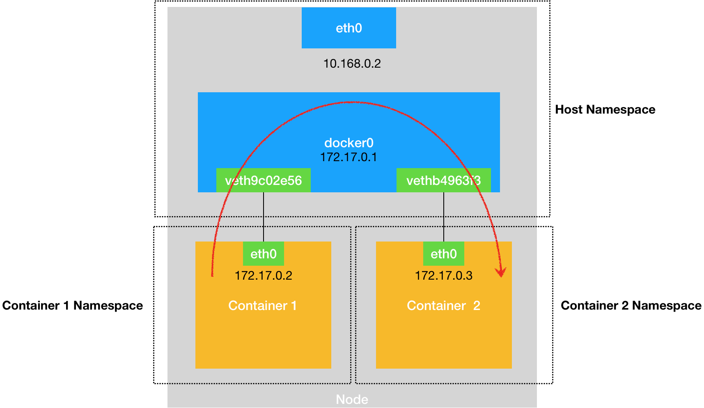
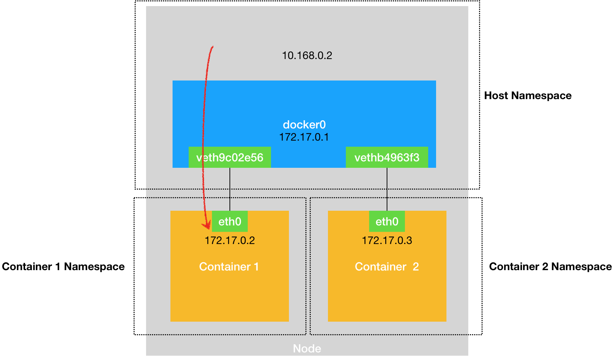
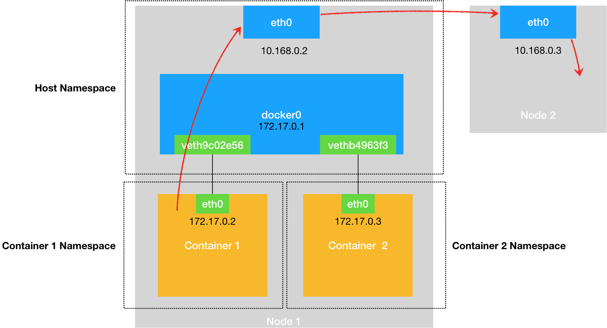
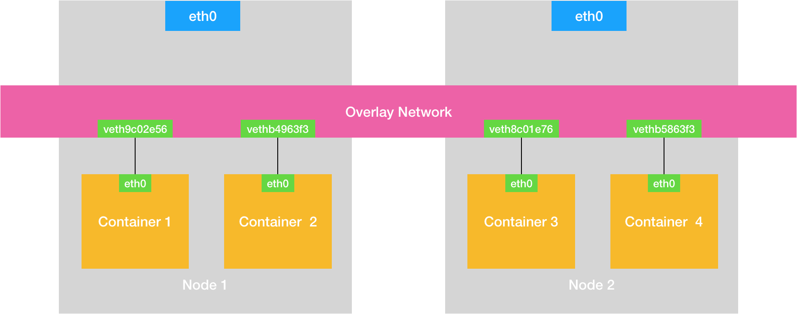

# Day14 深入剖析 Kubernetes - Kubernetes 容器網路

## 淺談容器網路

在 Linux 中，能夠起到虛擬交換機作用的網路設備，是**網橋（`Bridge`）**。它是一個工作在數據鏈路層（Data Link）的設備，**主要功能是根據 MAC 地址學習來將數據包轉發到網橋的不同端口（Port）上。**

Docker 項目會默認在宿主機上創建一個名叫 `docker0` 的網橋。

容器使用 `Veth Pair` 連結到 `docker0` 的網橋。 

- `Veth Pair` 設備的特點是：它被創建出來後，總是以兩張虛擬網卡（`Veth Peer`）的形式成對出現的。
- Veth Pair 常常被用作連接不同 Network Namespace 的網線。


這個 `eth0` 網卡是這個容器里的默認路由設備。所有對 `172.17.0.0/16` 網段的請求，也會被交給 `eth0` 來處理（第二條 `172.17.0.0` 路由規則）。

透過 `eth0` 網卡溝通容器和宿主機。

使用 `brctl show` 查看虛擬網卡 veth9c02e56 插在 docker0 上。

```shell
# 在宿主機上
$ docker exec -it nginx-1 /bin/bash
# 在容器里
root@2b3c181aecf1:/# ifconfig
eth0: flags=4163<UP,BROADCAST,RUNNING,MULTICAST>  mtu 1500
        inet 172.17.0.2  netmask 255.255.0.0  broadcast 0.0.0.0
        inet6 fe80::42:acff:fe11:2  prefixlen 64  scopeid 0x20<link>
        ether 02:42:ac:11:00:02  txqueuelen 0  (Ethernet)
        RX packets 364  bytes 8137175 (7.7 MiB)
        RX errors 0  dropped 0  overruns 0  frame 0
        TX packets 281  bytes 21161 (20.6 KiB)
        TX errors 0  dropped 0 overruns 0  carrier 0  collisions 0
        
lo: flags=73<UP,LOOPBACK,RUNNING>  mtu 65536
        inet 127.0.0.1  netmask 255.0.0.0
        inet6 ::1  prefixlen 128  scopeid 0x10<host>
        loop  txqueuelen 1000  (Local Loopback)
        RX packets 0  bytes 0 (0.0 B)
        RX errors 0  dropped 0  overruns 0  frame 0
        TX packets 0  bytes 0 (0.0 B)
        TX errors 0  dropped 0 overruns 0  carrier 0  collisions 0
        
$ route
Kernel IP routing table
Destination     Gateway         Genmask         Flags Metric Ref    Use Iface
default         172.17.0.1      0.0.0.0         UG    0      0        0 eth0
172.17.0.0      0.0.0.0         255.255.0.0     U     0      0        0 eth0
---
# 在宿主機上
$ ifconfig
...
docker0   Link encap:Ethernet  HWaddr 02:42:d8:e4:df:c1  
          inet addr:172.17.0.1  Bcast:0.0.0.0  Mask:255.255.0.0
          inet6 addr: fe80::42:d8ff:fee4:dfc1/64 Scope:Link
          UP BROADCAST RUNNING MULTICAST  MTU:1500  Metric:1
          RX packets:309 errors:0 dropped:0 overruns:0 frame:0
          TX packets:372 errors:0 dropped:0 overruns:0 carrier:0
 collisions:0 txqueuelen:0 
          RX bytes:18944 (18.9 KB)  TX bytes:8137789 (8.1 MB)
veth9c02e56 Link encap:Ethernet  HWaddr 52:81:0b:24:3d:da  
          inet6 addr: fe80::5081:bff:fe24:3dda/64 Scope:Link
          UP BROADCAST RUNNING MULTICAST  MTU:1500  Metric:1
          RX packets:288 errors:0 dropped:0 overruns:0 frame:0
          TX packets:371 errors:0 dropped:0 overruns:0 carrier:0
 collisions:0 txqueuelen:0 
          RX bytes:21608 (21.6 KB)  TX bytes:8137719 (8.1 MB)
          
$ brctl show
bridge name bridge id  STP enabled interfaces
docker0  8000.0242d8e4dfc1 no  veth9c02e56
```

上述提到的，凡是匹配到這條規則的 IP 包，應該經過本機的 eth0 網卡，通過二層網絡 (**MAC**) 直接發往目的主機。因此容器間可以透過網橋進行溝通。
```shell
$ route
Kernel IP routing table
Destination     Gateway         Genmask         Flags Metric Ref    Use Iface
default         172.17.0.1      0.0.0.0         UG    0      0        0 eth0
172.17.0.0      0.0.0.0         255.255.0.0     U     0      0        0 eth0
---
```
> ARP（Address Resolution Protocol），是通過三層的 IP 地址找到對應的二層 MAC 地址的協議。
> 
> 一旦**虛擬網卡插到網橋後，作用只剩接收流入數據包（處理交由網橋）**，無法調用網路協議棧處理數據。

容器間透過 docker0 網橋溝通示意圖


打開 **iptables** 的 **Trace** 功能可以查看數據傳輸過程，日誌會放在 ` /var/log/syslog` (可能因系統會有差異)
```shell
# 在宿主機上執行
$ iptables -t raw -A OUTPUT -p icmp -j TRACE
$ iptables -t raw -A PREROUTING -p icmp -j TRACE
```

宿主機透過訪問容器示意圖


容器連接對外網路（e.g. 另一台宿主機）示意圖


Kubernetes 集群網路示意圖
- 稱為 **Overlay 網路**
    - 特點為需要在已有的宿主機網絡上，**再通過軟件構建一個覆蓋在已有宿主機網絡之上的，可以把所有容器連通在一起的虛擬網絡**
    



## 小結

被限制在 Network Namespace 里的容器進程，實際上是通過 **Veth Pair 設備 + 宿主機網橋**的方式，實現了跟同其他容器的數據交換。

找 docker 和 宿主機上 veth 設備的關係
-  容器
```shell
$ ip netns exec netns1(network namespaces) ethool -S veth1
``` 
找到這個字段：
```
NIC statistics：
  peer_ifindex: 5(序列號)
```
-  宿主機
```shell
$ ip netns exec netns2 ip link | grep 5 <- 序列號
```
結果：veth0

此文章為2月Day14學習筆記，內容來源於極客時間[《深入剖析Kuberentes》](https://time.geekbang.org/column/article/64948)

《Linux0.11源碼趣讀》第二季重磅上線