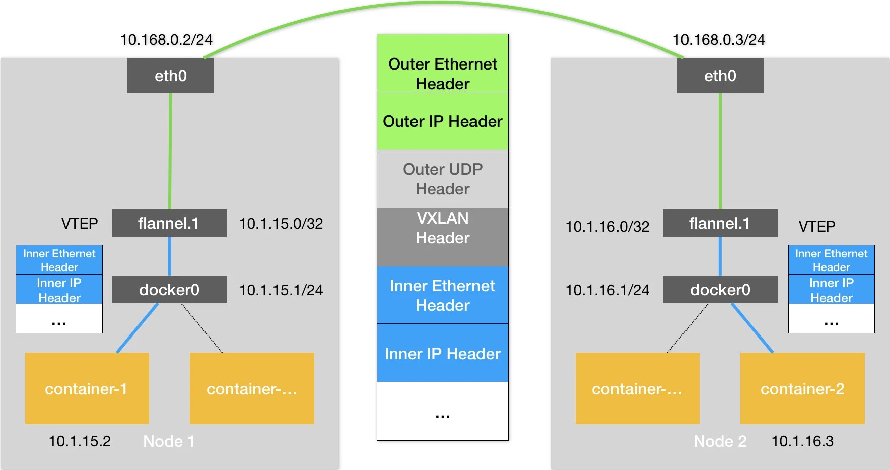

# Day15 深入剖析 Kubernetes - Kubernetes 容器網路

## 深入解析容器跨主機網絡

在 Docker 的默認配置下，不同宿主機上的容器通過 IP 地址進行互相訪問是無法做到的。
> 因為網橋 docker0 無法直接溝通。為了解決**跨主通訊**，才有現在各種的容器網路方案。

Flannel 項目是 CoreOS 公司主推的容器網絡方案。事實上，Flannel 項目本身只是一個框架，真正為我們提供容器網絡功能的，是 Flannel 的後端實現。
目前，Flannel 支持三種後端實現，分別是：
- VXLAN；
- host-gw；
- UDP

### Flannel - UDP
以例子說明 `UDP` 模式，假設兩台宿主機，container-1 要連到 container-2：

- 宿主機 Node 1 上有一個容器 container-1，它的 IP 地址是 `100.96.1.2`，對應的 docker0 網橋的地址是：`100.96.1.1/24`
- 宿主機 Node 2 上有一個容器 container-2，它的 IP 地址是 `100.96.2.3`，對應的 docker0 網橋的地址是：`100.96.2.1/24`

```shell
# 在Node 1上
$ ip route
default via 10.168.0.1 dev eth0
100.96.0.0/16 dev flannel0  proto kernel  scope link  src 100.96.1.0
100.96.1.0/24 dev docker0  proto kernel  scope link  src 100.96.1.1
10.168.0.0/24 dev eth0  proto kernel  scope link  src 10.168.0.2
---
# 在Node 2上
$ ip route
default via 10.168.0.1 dev eth0
100.96.0.0/16 dev flannel0  proto kernel  scope link  src 100.96.2.0
100.96.2.0/24 dev docker0  proto kernel  scope link  src 100.96.2.1
10.168.0.0/24 dev eth0  proto kernel  scope link  src 10.168.0.3
```

由於目標 IP 為 100.96.2.3，只會匹配到 **flannel0** 的規則，而 flannel0 為 TUN 設備 （Tunnel 設備）。

在 Linux 中，TUN 設備是一種工作在三層（Network Layer）的虛擬網絡設備。TUN 設備的功能非常簡單，即：在操作系統內核和用戶應用程序之間傳遞 IP 包。

> 當操作系統將一個 IP 包發送給 **flannel0** 設備之後，**flannel0** 就會把這個 IP 包，交給創建這個設備的應用程序，也就是 Flannel 進程。這是一個從內核態（Linux 操作系統）向用戶態（Flannel 進程）的流動方向。

Flannel有子網的概念，一台宿主機的容器地址屬於同一個子網，所以跨主通信時候可以根據目的地址找到對應的宿主機。

在例子中，Node 1 的子網是 100.96.1.0/24，container-1 的 IP 地址是 100.96.1.2。Node 2 的子網是 100.96.2.0/24，container-2 的 IP 地址是 100.96.2.3。

這些**子網與宿主機的對應關係**，正是**保存在 Etcd** 當中，如下所示：
```shell
$ etcdctl ls /coreos.com/network/subnets
/coreos.com/network/subnets/100.96.1.0-24
/coreos.com/network/subnets/100.96.2.0-24
/coreos.com/network/subnets/100.96.3.0-24s
---
$ etcdctl get /coreos.com/network/subnets/100.96.2.0-24
{"PublicIP":"10.168.0.3"}
```
flanneld 在收到 container-1 發給 container-2 的 IP 包之後，就會把**這個 IP 包直接封裝在一個 UDP 包**里，然後發送給 Node 2。這個 UDP 包的源地址，就是 flanneld 所在的 Node 1 的地址，而目的地址，則是 container-2 所在的宿主機 Node 2 的地址。

> 重要前提， docker0 網橋的地址範圍必須是 Flannel 為宿主機分配的子網
> ```shell
> $ FLANNEL_SUBNET=100.96.1.1/24
> $ dockerd --bip=$FLANNEL_SUBNET ...
> ```

基於 Flannel UDP 跨主機通訊基本原理


基於 Flannel VXLAN 模式的跨主通信的基本原理



## 小結


此文章為2月Day15學習筆記，內容來源於極客時間[《深入剖析Kuberentes》](https://time.geekbang.org/column/article/65287)

《Linux0.11源碼趣讀》第二季重磅上線