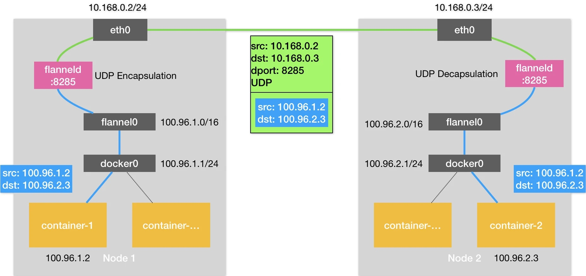

# Day15 深入剖析 Kubernetes - Kubernetes 容器網路

## 深入解析容器跨主機網絡

基於 Flannel UDP 跨主機通訊基本原理

此文章為2月Day15學習筆記，內容來源於極客時間[《深入剖析Kuberentes》](https://time.geekbang.org/column/article/65287)

《Linux0.11源碼趣讀》第二季重磅上線