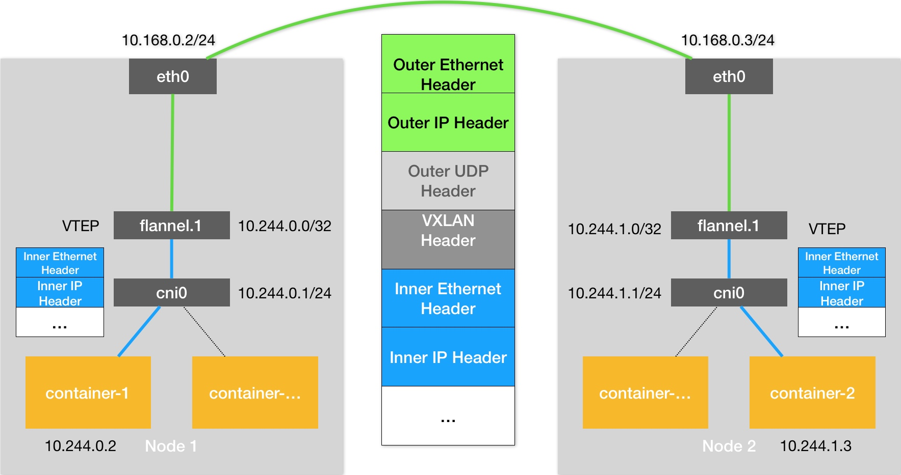

# Day16 深入剖析 Kubernetes - Kubernetes 容器網路

## Kubernetes網路模型與CNI網路插件

從前面例子，可以觀察到有一個共同點，那就是用戶的容器都連接在 `docker0` 網橋上。而網絡插件則在宿主機上創建了一個特殊的設備（**UDP 模式創建的是 TUN 設備，VXLAN 模式創建的則是 VTEP 設備**），docker0 與這個設備之間，通過 **IP 轉發（路由表）進行協作**。

Kubernetes 是通過一個叫作 CNI 的接口，維護了一個單獨的網橋來代替 `docker0`。這個網橋的名字就叫作：**CNI 網橋**，它在宿主機上的設備名稱默認是：`cni0`。

> 網絡插件真正要做的事情，則是通過某種方法，把**不同宿主機上的特殊設備連通，從而達到容器跨主機通信的目的**。

docker0 換成 cni0 示意圖
- flannel 分配網段 `10.168.0.0/16`
    - 可以透過集群建立時，指定網段
    - 在部署完成後，通過修改 `kube-controller-manager` 的配置文件來指定
```shell
$ kubeadm init --pod-network-cidr=10.244.0.0/16
```


路由表
```shell
# 在 Node 1 上
$ route -n
Kernel IP routing table
Destination     Gateway         Genmask         Flags Metric Ref    Use Iface
...
10.244.0.0      0.0.0.0         255.255.255.0   U     0      0        0 cni0
10.244.1.0      10.244.1.0      255.255.255.0   UG    0      0        0 flannel.1
172.17.0.0      0.0.0.0         255.255.0.0     U     0      0        0 docker0
```
> CNI 網橋只是接管所有 CNI 插件負責的、即 Kubernetes 創建的容器（Pod）

Kubernetes 之所以要設置這樣一個與 docker0 網橋功能幾乎一樣的 CNI 網橋，主要原因包括兩個方面：

- Kubernetes 項目並沒有使用 Docker 的網絡模型（CNM），所以它並不希望、也不具備配置 docker0 網橋的能力
- 與 Kubernetes 如何配置 Pod，也就是 Infra 容器的 Network Namespace 密切相關

CNI 的基礎可執行文件，按照功能可以分為三類：

1. Main 插件，它是用來創建具體網絡設備的二進制文件
2. IPAM（IP Address Management）插件，它是負責分配 IP 地址的二進制文件
3. CNI 社區維護的內置 CNI 插件

CNI 配置文件如下所示
```shell
$ cat /etc/cni/net.d/10-flannel.conflist 
{
  "name": "cbr0",
  "plugins": [
    {
      "type": "flannel",
      "delegate": {
        "hairpinMode": true,
        "isDefaultGateway": true
      }
    },
    {
      "type": "portmap",
      "capabilities": {
        "portMappings": true
      }
    }
  ]
}
```

> Kubernetes 中，處理容器網絡相關的邏輯並不會在 kubelet 主幹代碼里執行，而是會在具體的 CRI（Container Runtime Interface，容器運行時接口）實現里完成。


## 小結

思考題：為什麼 Kubernetes 項目不自己實現容器網路，而是要通過 CNI 做一個如此簡單的假設呢？

解答：沒有親歷 Kubernetes 網路標準化的這個階段，以下內容都是基於猜測，大家見笑了。
最開始我覺得這就是為了提供更多的便利選擇，有了 CNI，那麼只要符合規則，什麼插件都可以用，用戶的自由度更高，這是 Google 和 Kubernetes 開放性的體現。但轉念一想，如果 Kubernetes 一開始就有官方的解決方案，恐怕也不會有什麼不妥，感覺要理解的更深，得追溯到 Kubernetes 創建之初的外部環境和 Google 的開源策略了。Github 上最早的 Kubernetes 版本是 0.4，其中的網路部分，最開始官方的實現方式就是 GCE 執行 salt 腳本創建 bridge，其他環境的推薦的方案是 Flannel 和 OVS。
所以我猜測：
首先給 Kubernetes 發展的時間是不多的（Docker 已經大紅大紫了，再不趕緊就一統天下了），給開發團隊的時間只夠專心實現編排這種最核心的功能，網路功能恰好盟友 CoreOS 的 Flannel 可以拿過來用，所以也可以認為 Flannel 就是最初 Kubernetes 的官方網路插件。Kubernetes 發展起來之後，Flannel 在有些情況下就不夠用了，15 年左右社區里 Calico 和  Weave 冒了出來，基本解決了網路問題，Kubernetes 就更不需要自己花精力來做這件事了，所以推出了 CNI，來做網路插件的標準化。我覺得假如社區里網路一直沒有好的解決方案的話，Kubernetes 肯定還是會親自上陣的。
其次，Google 開源項目畢竟也不是做慈善，什麼都做的面面俱到，那要消耗更多的成本，當然是越多的外部資源為我所用越好了。感覺推出核心功能，吸引開發者過來做貢獻的搞法，也算是巨頭們開源的一種套路吧。

此文章為2月Day16學習筆記，內容來源於極客時間[《深入剖析Kuberentes》](https://time.geekbang.org/column/article/67351)

《Linux0.11源碼趣讀》第二季重磅上線