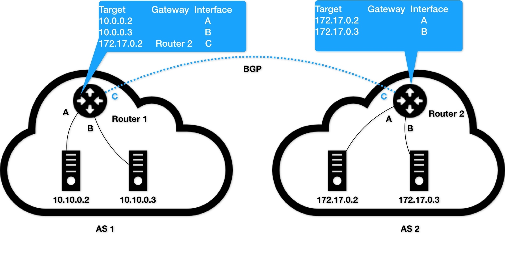

# Day17 深入剖析 Kubernetes - Kubernetes 容器網路

## 解讀Kubernetes三層網路方案

### Flannel
除了 Bridge 網橋模式之外，還有一種**純三層（Pure Layer 3）網路方案**非常值得你注意。其中的典型例子，莫過於 **Flannel 的 host-gw 模式和 Calico 項目**了。

`host-gw` 模式的工作原理，其實就是將每個 Flannel 子網（Flannel Subnet，比如：10.244.1.0/24）的下一個地址(下一跳)，設置成了該子網對應的宿主機的 IP 地址。

```shell
$ ip route
...
10.244.1.0/24 via 10.168.0.3 dev eth0
```
Flannel host-gw 模式示意圖


根據實際的測試，host-gw 的性能損失大約在 10% 左右，而其他所有基於 VXLAN 隧道機制的網路方案，性能損失都在 20%~30% 左右。

host-gw 模式的核心，就在於 IP 包在封裝成幀發送出去的時候，會**使用路由表裡的下一跳來設置目的 MAC 地址**。這樣，它就會經過二層網路到達目的宿主機。
> Flannel host-gw 模式必須要求集群宿主機之間是二層連通的。

### Calico

如同 Flannel 需要添加路由規則在宿主機上
```shell
<目的容器IP地址段> via <網關的IP地址> dev eth0
```
**不同於 Flannel 通過 Etcd 和宿主機上的 flanneld 來維護路由訊息**的做法，Calico 項目使用 `BGP` 來自動地在整個集群中分發路由訊息。

- BGP： `Border Gateway Protocal` 邊界網關協議，它是一個 Linux 內核原生就支持的、專門用在大規模數據中心裡維護不同的自治系統之間路由訊息的、無中心的路由協議。


路由器各自維護自己管轄的路由表外，還紀錄了邊界路由網關的訊息。
**邊界網關**，跟普通路由器的不同之處在於，它的路由表裡擁有其他自治系統里的主機路由訊息。

> BGP，簡單來說，為在大規模網路中實現節點路由訊息共享的一種協議。但實際上也是最為複雜的路由協議。

Calico 分為三部分：

- Calico 的 CNI 插件，這是 Calico 與 Kubernetes 對接的部分。
- Felix：它是一個 DaemonSet，負責在宿主機上插入路由規則（即：寫入 Linux 內核的 FIB 轉發訊息庫），以及維護 Calico 所需的網路設備等工作
- BIRD：它就是 BGP 的客戶端，專門負責在集群里分發路由規則訊息。

Calico 工作原理


> 除了對路由訊息的維護方式之外，Calico 項目與 Flannel 的 host-gw 模式的另一個不同之處，就是它**不會在宿主機上創建任何網橋設備**。

**由於 Calico 沒有使用 CNI 的網橋模式，Calico 的 CNI 插件還需要在宿主機上為每個容器的 Veth Pair 設備配置一條路由規則，用於接收傳入的 IP 包。**

如 Node 2 上的 Container 4 對應的路由規則
```shell
10.233.2.3 dev cali5863f3 scope link
```

這裡最核心的尋找**下一跳**路由規則，就是由 **Calico 的 Felix 進程負責維護的**。**這些路由規則訊息，則是通過 BGP Client 也就是 BIRD 組件，使用 BGP 協議傳輸**而來的

BGP 路由協議格式示意圖
```
[BGP消息]
我是宿主機192.168.1.3
10.233.2.0/24網段的容器都在我這裡
這些容器的下一跳地址是我
```

Calico 維護的網路在默認配置下，是一個被稱為 `Node-to-Node Mesh` 的模式。
**Node-to-Node Mesh 模式一般推薦用在少於 100 個節點的集群**里。而在更大規模的集群中，你需要用到的是一個叫作 `Route Reflector` 的模式。

> Route Reflector 模式：為找幾個或是專門的節點建立全量節點路由表，其餘節點只需要跟這些專門節點同步節點訊息即可。

Flannel host-gw 模式最主要的限制，就是要求集群宿主機之間是二層連通的。而這個限制也同樣適用於 Calico。**在二層沒有通的情況下，就需要為 Calico 開啟 IPIP 模式**。

Calico IPIP 模式工作原理示意圖


IPIP 模式下，Felix 進程在 Node1 加入的路由規則如下
```
10.233.2.0/24 via 192.168.2.2 tunl0
```

Calico 使用的這個 `tunl0` 設備，是一個 IP 隧道（`IP tunnel`）設備。跟前面提到的 `tun0` 是不同設備（ tun0 為二層隧道）。

IPIP 模式封包方式，為 **IPIP 驅動會將這個 IP 包直接封裝在一個宿主機網路的 IP 包中**

> 當 Calico 使用 IPIP 模式的時候，集群的網路性能會因為額外的封包和解包工作而下降。在實際測試中，Calico IPIP 模式與 Flannel VXLAN 模式的性能大致相當。

在大多數公有雲環境下，宿主機（公有雲提供的虛擬機）本身往往就是二層連通的，所以這個需求也不強烈；而私有雲環境，宿主機常見屬於不同子網的例子。

因此，Calico 提供兩種將網關設置成 BGP Peer 方式，避免使用 IPIP 模式：

- 所有宿主機都跟宿主機網關建立 BGP Peer
    - 需要要求宿主機網關支持 `Dynamic Neighbor` BGP 配置方式
- 使用一個或是特定獨立組件搜集集群路由訊息，匯報給網關

## 小結

host-gw 模式：**主機（Host）會充當這條容器通信路徑里的網關（Gateway）**。

在 Kubernetes v1.7 之後，類似 Flannel、Calico 的 **CNI 網路插件**都是可以直接連接 Kubernetes 的 APIServer 來訪問 Etcd 的，**無需額外部署 Etcd 給它們使用**。


在大規模集群里，三層網路方案在宿主機上的路由規則可能會非常多，這會導致錯誤排查變得困難。此外，在系統故障的時候，路由規則出現重疊衝突的概率也會變大。

- 如果是在公有雲上，由於宿主機網路本身互通有無，一般建議使用更加簡單的 Flannel host-gw 模式
- 在私有部署環境里，Calico 項目才能夠覆蓋更多的場景，並提供更加可靠的組網方案和架構思路

此文章為2月Day17學習筆記，內容來源於極客時間[《深入剖析Kuberentes》](https://time.geekbang.org/column/article/67775)

《Linux0.11源碼趣讀》第二季重磅上線