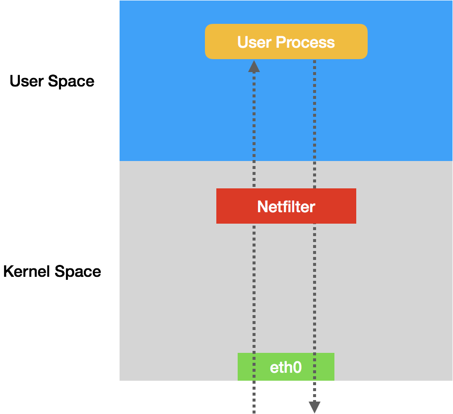
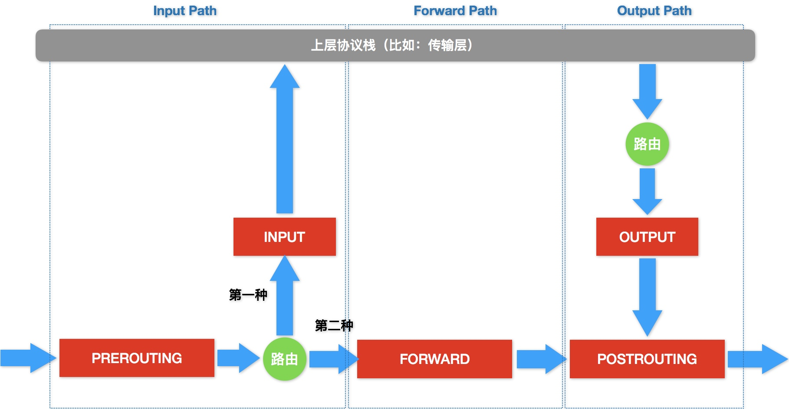
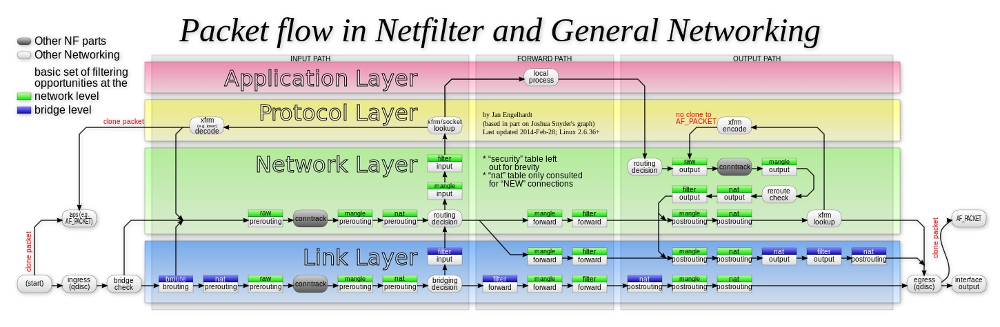

# Day18 深入剖析 Kubernetes - Kubernetes 容器網路

## 為什麼說 Kubernetes 只有 soft multi-tenancy？

在 Kubernetes 里，網路隔離能力的定義，是依靠一種專門的 API 對象來描述的，NetworkPolicy。

一個 NetworkPolicy 例子
```yaml
apiVersion: networking.k8s.io/v1
kind: NetworkPolicy
metadata:
  name: test-network-policy
  namespace: default
spec:
  podSelector:
    matchLabels:
      role: db
  policyTypes:
  - Ingress
  - Egress
  ingress:
  - from:
    - ipBlock:
        cidr: 172.17.0.0/16
        except:
        - 172.17.1.0/24
    - namespaceSelector:
        matchLabels:
          project: myproject
    - podSelector:
        matchLabels:
          role: frontend
    ports:
    - protocol: TCP
      port: 6379
  egress:
  - to:
    - ipBlock:
        cidr: 10.0.0.0/24
    ports:
    - protocol: TCP
      port: 5978
```

這個 NetworkPolicy 對象，指定的隔離規則如下所示（以上述 YAML 為例）：

- 該隔離規則只對 `default Namespace` 下的，攜帶了 `role=db` 標籤的 Pod 有效。限制的請求類型包括 **ingress（流入）和 egress（流出)**。
- Kubernetes 會拒絕任何訪問被隔離 Pod 的請求，除非這個請求來自於以下**白名單**的對象，並且訪問的是被隔離 Pod 的 `6379` 端口。這些白名單對象包括：
    - `default Namespace` 里的，攜帶了 `role=fronted` 標籤的 Pod；
    - 攜帶了 `project=myproject` 標籤的 Namespace 里的任何 Pod；
    - 任何源地址屬於 `172.17.0.0/16` 網段，且不屬於 `172.17.1.0/24` 網段的請求。
- Kubernetes 會**拒絕**被隔離 Pod 對外發起任何請求，除非請求的目的地址屬於 `10.0.0.0/24` 網段，並且訪問的是該網段地址的 `5978` 端口。

> 默認接收所有請求。**podSelector 字段，定義這個 NetworkPolicy 的限制範圍**。
> NetworkPolicy 定義的規則，其實就是白名單

```yaml
# 條件為 OR 關係
  ...
  ingress:
  - from:
    - namespaceSelector:
        matchLabels:
          user: alice
    - podSelector:
        matchLabels:
          role: client
  ...
---
# 條件為 AND 關係
...
  ingress:
  - from:
    - namespaceSelector:
        matchLabels:
          user: alice
      podSelector: # 前面少了 "-"
        matchLabels:
          role: client
  ...
```

凡是支持 NetworkPolicy 的 CNI 網路插件，都維護著一個 NetworkPolicy Controller，通過控制循環的方式對 NetworkPolicy 對象的增刪改查做出響應，然後在宿主機上完成 iptables 規則的配置工作。

以 Go 偽代碼示意
```go
for dstIP := range 所有被networkpolicy.spec.podSelector選中的Pod的IP地址
  for srcIP := range 所有被ingress.from.podSelector選中的Pod的IP地址
    for port, protocol := range ingress.ports {
      iptables -A KUBE-NWPLCY-CHAIN -s $srcIP -d $dstIP -p $protocol -m $protocol --dport $port -j ACCEPT 
    }
  }
} 
```

> 可以看到，**Kubernetes 網路插件對 Pod 進行隔離，其實是靠在宿主機上生成 NetworkPolicy 對應的 iptable 規則來實現**的。

iptables 只是一個操作 Linux 內核 Netfilter 子系統的界面。而Netfilter 子系統的作用，就是 **Linux 內核里擋在網卡和用戶態進程之間的一道防火牆**。

iptables 控制示意圖

在 iptables 中，**這些檢查點被稱為：鏈（Chain）**。這是因為這些檢查點對應的 iptables 規則，是按照**定義順序依次進行匹配**的。

iptables 檢查點示意圖


這些鏈路層的檢查點對應的操作界面叫作 `ebtables`。
Netfilter 官方原理圖

> 前面所述部分為綠色 Network 層的 iptables 工作流程

假設 Network Policy 規則流程，討論CNI 網路插件實現 NetworkPolicy 的基本方法
```yaml
apiVersion: extensions/v1beta1
kind: NetworkPolicy
metadata:
  name: test-network-policy
  namespace: default
spec:
  podSelector:
    matchLabels:
      role: db
  ingress:
   - from:
     - namespaceSelector:
         matchLabels:
           project: myproject
     - podSelector:
         matchLabels:
           role: frontend
     ports:
       - protocol: tcp
         port: 6379
---
for dstIP := range 所有被networkpolicy.spec.podSelector選中的Pod的IP地址
  for srcIP := range 所有被ingress.from.podSelector選中的Pod的IP地址
    for port, protocol := range ingress.ports {
      iptables -A KUBE-NWPLCY-CHAIN -s $srcIP -d $dstIP -p $protocol -m $protocol --dport $port -j ACCEPT 
    }
  }
} 
---
for pod := range 該Node上的所有Pod {
    if pod是networkpolicy.spec.podSelector選中的 {
        iptables -A FORWARD -d $podIP -m physdev --physdev-is-bridged -j KUBE-POD-SPECIFIC-FW-CHAIN
        iptables -A FORWARD -d $podIP -j KUBE-POD-SPECIFIC-FW-CHAIN
        ...
    }
}
---
iptables -A FORWARD -d $podIP -m physdev --physdev-is-bridged -j KUBE-POD-SPECIFIC-FW-CHAIN
iptables -A FORWARD -d $podIP -j KUBE-POD-SPECIFIC-FW-CHAIN
...
---
iptables -A KUBE-POD-SPECIFIC-FW-CHAIN -j KUBE-NWPLCY-CHAIN
iptables -A KUBE-POD-SPECIFIC-FW-CHAIN -j REJECT --reject-with icmp-port-unreachable
```

在第一條規則里，我們會把 IP 包轉交給前面定義的 `KUBE-NWPLCY-CHAIN` 規則去進行匹配。按照我們之前的講述，如果匹配成功，那麼 IP 包就會被允許通過。

而如果匹配失敗，IP 包就會來到第二條規則上。可以看到，它是一條 REJECT 規則。通過這條規則，不滿足 NetworkPolicy 定義的請求就會被拒絕掉，從而實現了對該容器的隔離。

## 小結

NetworkPolicy 實際上只是宿主機上的一系列 iptables 規則。跟傳統 IaaS 裡面的安全組（Security Group）非常類似。

Kubernetes 從底層的設計和實現上，更傾向於假設你已經有了一套完整的物理基礎設施。然後，Kubernetes 負責在此基礎上提供一種**弱多租戶**（soft multi-tenancy）的能力。

Kubernetes 項目在雲計算生態里的定位，其實是基礎設施與 PaaS 之間的中間層。這是非常符合容器這個本質，進程抽象級別的粒度。


此文章為2月Day18學習筆記，內容來源於極客時間[《深入剖析Kuberentes》](https://time.geekbang.org/column/article/68316)

《Linux0.11源碼趣讀》第二季重磅上線