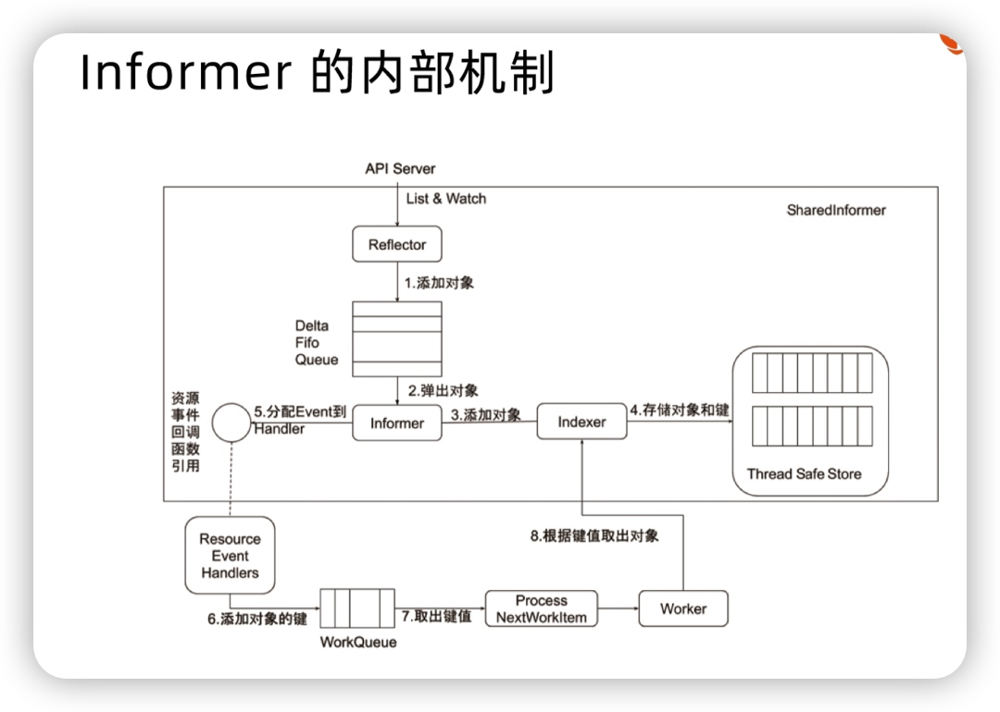

# Day19 深入剖析 Kubernetes - Kubernetes 容器網路

## 找到容器不容易：Service、DNS與服務發現

Kubernetes 之所以需要 Service，兩方面因素
- **Pod 的 IP 不是固定的**
- **Pod 實例之間總會有負載均衡的需求**。

Service 定義如下所示
```yaml
apiVersion: v1
kind: Service
metadata:
  name: hostnames
spec:
  selector:
    app: hostnames
  ports:
  - name: default
    protocol: TCP
    port: 80
    targetPort: 9376
```
對應 Deployment 如下所示
```yaml
apiVersion: apps/v1
kind: Deployment
metadata:
  name: hostnames
spec:
  selector:
    matchLabels:
      app: hostnames
  replicas: 3
  template:
    metadata:
      labels:
        app: hostnames
    spec:
      containers:
      - name: hostnames
        image: k8s.gcr.io/serve_hostname
        ports:
        - containerPort: 9376
          protocol: TCP
```

被 selector 選中的 Pod，被稱為 Service 的 `Endpoints`，可以透過 `kubectl get endpoints` 查看
```shell
$ kubectl get endpoints hostnames
NAME        ENDPOINTS
hostnames   10.244.0.5:9376,10.244.0.6:9376,10.244.0.7:9376
```
> 只有處於 Running 狀態，且 `readinessProbe` 檢查通過的 Pod，才會出現在 Service 的 Endpoints 列表裡

**Service 是由 `kube-proxy` 組件，加上 `iptables` 來共同實現的。**

kube-proxy 透過 Service 的 `Informer`，感知到新對象加入，作為事件響應，會建立一組 iptabes 規則
```shell
$ kubectl get svc hostnames
NAME        TYPE        CLUSTER-IP   EXTERNAL-IP   PORT(S)   AGE
hostnames   ClusterIP   10.0.1.175   <none>        80/TCP    5s
---
iptables -A KUBE-SERVICES -d 10.0.1.175/32 -p tcp -m comment --comment "default/hostnames: cluster IP" -m tcp --dport 80 -j KUBE-SVC-NWV5X2332I4OT4T3
```
而跳轉的規則 `KUBE-SVC-NWV5X2332I4OT4T3`，實際為一組規則集合
```shell
-A KUBE-SVC-NWV5X2332I4OT4T3 -m comment --comment "default/hostnames:" -m statistic --mode random --probability 0.33332999982 -j KUBE-SEP-WNBA2IHDGP2BOBGZ
-A KUBE-SVC-NWV5X2332I4OT4T3 -m comment --comment "default/hostnames:" -m statistic --mode random --probability 0.50000000000 -j KUBE-SEP-X3P2623AGDH6CDF3
-A KUBE-SVC-NWV5X2332I4OT4T3 -m comment --comment "default/hostnames:" -j KUBE-SEP-57KPRZ3JQVENLNBR
---
# 三條規則的細節

-A KUBE-SEP-57KPRZ3JQVENLNBR -s 10.244.3.6/32 -m comment --comment "default/hostnames:" -j MARK --set-xmark 0x00004000/0x00004000
-A KUBE-SEP-57KPRZ3JQVENLNBR -p tcp -m comment --comment "default/hostnames:" -m tcp -j DNAT --to-destination 10.244.3.6:9376

-A KUBE-SEP-WNBA2IHDGP2BOBGZ -s 10.244.1.7/32 -m comment --comment "default/hostnames:" -j MARK --set-xmark 0x00004000/0x00004000
-A KUBE-SEP-WNBA2IHDGP2BOBGZ -p tcp -m comment --comment "default/hostnames:" -m tcp -j DNAT --to-destination 10.244.1.7:9376

-A KUBE-SEP-X3P2623AGDH6CDF3 -s 10.244.2.3/32 -m comment --comment "default/hostnames:" -j MARK --set-xmark 0x00004000/0x00004000
-A KUBE-SEP-X3P2623AGDH6CDF3 -p tcp -m comment --comment "default/hostnames:" -m tcp -j DNAT --to-destination 10.244.2.3:9376
```
這組規則，為隨機模式（`--mode random`）的 iptables chain
> 為這個 Service 代理的三個 Pod。這一組規則，其實就是 Service 實現負載均衡的位置。

> 補充： Informer 流程圖
> 

這些 **Endpoints 對應的 iptables 規則，正是 `kube-proxy` 通過監聽 Pod 的變化事件，在宿主機上生成並維護的**。

除此之外，Kubernetes 的 kube-proxy 還支持一種叫作 `IPVS` 的模式。

當宿主機上有大量 Pod 的時候，成百上千條 iptables 規則不斷地被刷新，會大量佔用該宿主機的 CPU 資源。一直以來，基於 iptables 的 Service 實現，都是制約 Kubernetes 項目承載更多量級的 Pod 的主要障礙。
-  **IPVS 模式的 Service**，就是解決這個問題的一個有效方法。

IPVS 模式的工作原理，其實跟 iptables 模式類似。當創建了前面的 Service 之後，kube-proxy 首先會在宿主機上創建一個虛擬網卡（`kube-ipvs0`），並為它分配 Service VIP 作為 IP 地址。
```shell
# ip addr
  ...
  73：kube-ipvs0：<BROADCAST,NOARP>  mtu 1500 qdisc noop state DOWN qlen 1000
  link/ether  1a:ce:f5:5f:c1:4d brd ff:ff:ff:ff:ff:ff
  inet 10.0.1.175/32  scope global kube-ipvs0
  valid_lft forever  preferred_lft forever
```
kube-proxy 就會通過 **Linux 的 IPVS 模塊**，為這個 IP 地址設置三個 IPVS 虛擬主機，並設置這三個虛擬主機之間使用輪詢模式 (rr) 來作為負載均衡策略。我們可以通過 `ipvsadm` 查看到這個設置。
```shell
# ipvsadm -ln
 IP Virtual Server version 1.2.1 (size=4096)
  Prot LocalAddress:Port Scheduler Flags
    ->  RemoteAddress:Port           Forward  Weight ActiveConn InActConn     
  TCP  10.102.128.4:80 rr
    ->  10.244.3.6:9376    Masq    1       0          0         
    ->  10.244.1.7:9376    Masq    1       0          0
    ->  10.244.2.3:9376    Masq    1       0          0
```

理論上 IPVS 並沒有顯著的性能提升。但是，**IPVS 並不需要在宿主機上為每個 Pod 設置 iptables 規則**，而是把對這些規則的處理放到了內核態，從而極大地降低了維護這些規則的代價。這也正印證了我在前面提到過的，將**重要操作放入內核態是提高性能的重要手段**。

> **IPVS 模塊只負責上述的負載均衡和代理功能**。而**一個完整的 Service 流程正常工作所需要的`包過濾`、`SNAT` 等操作，還是要靠 `iptables` 來實現。**
> 
> 在大規模集群里，建議為 kube-proxy 設置 `–proxy-mode=ipvs` 來開啓這個功能。它為 Kubernetes 集群規模帶來的提升，還是非常巨大的。

對於 **ClusterIP 模式的 Service** 來說，它代理的 Pod 被自動分配的 A 記錄的格式是：`..pod.cluster.local`。這條記錄指向 Pod 的 IP 地址。

而對 **Headless Service** 來說，它代理的 Pod 被自動分配的 A 記錄的格式是：`..svc.cluster.local`。這條記錄也指向 Pod 的 IP 地址。


對應於 ClusterIP: 通過`<serviceName>.<namespace>.svc.cluster.local` 訪問。
對應於 Headless Service: 通過`<podName>.<serviceName>.<namesapce>.svc.cluster.local` 訪問
```shell
# nslookup *.default.svc.cluster.local
Server:    10.96.0.10
Address 1: 10.96.0.10 kube-dns.kube-system.svc.cluster.local

Name:      *.default.svc.cluster.local
Address 1: 10.244.1.7 busybox-3.default-subdomain.default.svc.cluster.local
Address 2: 10.96.0.1 kubernetes.default.svc.cluster.local
Address 3: 10.97.103.223 hostnames.default.svc.cluster.local
```

## 小結

**Service 是由 `kube-proxy` 組件，加上 `iptables` 來共同實現的。**

ClusterIP 模式的 Service 提供一個 Pod 的穩定的 IP 地址，即 VIP。並且，**Pod 和 Service 的關係是可以通過 Label 確定**。

Headless Service，則是一個 **Pod 的穩定的 DNS 名字**，並且，這個名字是可以通過 Pod 名字和 Service 名字拼接出來的。

在 Kubernetes 里 `/etc/hosts` 文件是單獨掛載的，**這也是為什麼 kubelet 能夠對 hostname 進行修改並且 Pod 重建後依然有效的原因**。這跟 Docker 的 Init 層是一個原理。

此文章為2月Day19學習筆記，內容來源於極客時間[《深入剖析Kuberentes》](https://time.geekbang.org/column/article/68636)

《Linux0.11源碼趣讀》第二季重磅上線